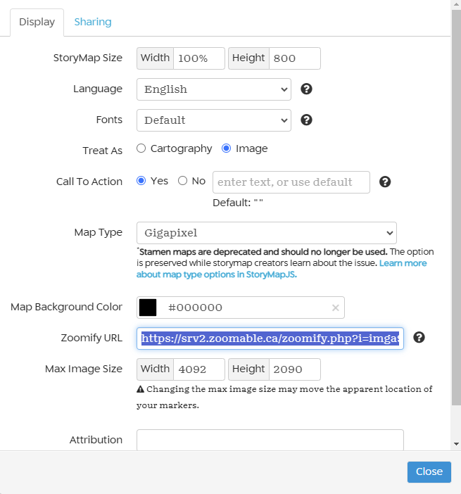

# StoryMapJS

This tutorial was adapted from a previous tutorial created by Elana Altman the Barnard College Digital Humanities Center

*Adapted by Taylor Faires*

This work is licensed under a [Creative Commons Attribution 4.0 International License](http://creativecommons.org/licenses/by/4.0/).

Introduction to the tool:
-------------------------

StoryMapsJS is a free , open-tool that allows you to create location-based narratives with embedded media. It has a low barrier to entry with customizable features for more advanced projects.

### The tool is great for:

-   Telling stories that have a spatial component
-   Exploring facets of a 2D visual object (work of art, diagram, historical or fictional maps)
-   Quick, simple digital projects such as class assignments or a standalon part of a larger digital project

### The tool is not great for:

-   Combining quantitative data with mapping
-   Creating complex interactive maps
-   Making extremely customized visuals
-   Collaborating with multiple people on one StoryMap (particularly if you're not in the same physical space)

### Materials:

-   [https://storymap.knightlab.com](https://storymap.knightlab.com/)
-   Reliable web browser (preferably Chrome or Firefox)
-   A Google account (if you are unable to access Google in your country, there are ways to host your own Storymap that require some Javascript)

### Accessibility Considerations:

-   *When using StoryMapJS:*
    The StoryMapJS tool works with assistive technologies, and people with disabilities can make basic StoryMaps. However, the StoryMaps tool can be frustrating for a visually-disabled person to navigate with a screenreader.  Additionally, much of the text in the StoryMapJS tool lacks sufficient color contrast.
    When using StoryMap with an image as a map (the "gigapixel" options), a visually-disabled user may run into some problems placing locations markers on the image. If working in a group, this specific task can be assigned to another group member.

-   *When accessing published StoryMaps:* StoryMaps can be difficult to navigate for screenreader users. Because of the ways StoryMapsJS is structured, a person using a screenreader will hear a lot of nonsensical information before getting to the actual content of the StoryMap. This issue is usually worse when using an image as a map. Unfortunately, this issue is not something you can fix when making a StoryMap.
Please be aware it's always possible that there are accessibility concerns that have yet to be discovered. Additionally, remember that CARDS can always help with making assignments accessible for students with disabilities.

# Tutorial

## Step 1: Getting Started

### Familiarizing Yourself with the Format

To understand the types of projects that work well for this tool, it is helpful to look at some examples. As you take a look at the examples below, keep in mind that visualizing information always involves privelaging specific narratives. How do these StoryMaps shape your view of cause and effect? Are there assumptions that underly these stories? These questions may not be easy to answer, especially for the examples that aren't about historical events, but it's always helpful to reflect on how visualizing information affects understanding before starting your own project.

-   [Golden Gate to Haight: Distrusting The Government, Trusting Love](https://uploads.knightlab.com/storymapjs/520b5153c4a0fef7be4fdf56f95736fc/antiwar-protests-in-san-francisco-1960-1975/index.html)
-   [Ancient Rome in Chicago](https://s3.amazonaws.com/uploads.knightlab.com/storymapjs/783a09de8300e1b5f74b99b99acb08ef/ancient-rome-in-chicago/index.html)
-   [Hieronymus Bosch's "Garden of Earthly Delights"](https://storymap.knightlab.com/examples/bosch-garden/)
-   [Midwest Time Machine](https://publications.newberry.org/time-machine/) (note that this is a collection of StoryMaps rather than one specific StoryMap)

### Signing up for StoryMapJS

The easiest way to create a StoryMap is to use the StoryMapJS Authoring Tool. This requires you to sign-in through Google:
1. Make your way to the [StoryMapJS webpage](https://storymap.knightlab.com/).
2. Click on the "Create a StoryMap" button.
3. Once on the Authoring Tool page, you will be prompted to log-in with Google.
4. You will see a pop-up with an option to create a new StoryMap.
   
5. Once you have created a new StoryMap, you will be able to view your project's editing interface
   

### StoryMapJS Authoring Tool

The StoryMapJS Authoring Tool has two views: Edit and Preview. The Edit interface is where you can add new slides to your StoryMap and edit information. You can check the Preview tab to see how your StoryMap will look once published. If you look to the Preview tab before adding any information, it will look pretty empty; however, below is a description of the different components of a StoryMap.

Each StoryMap includes a title slide, and then several location slides. The slides themselves are fairly structured, so it's useful to understand the components before building your map:

#### *For Title Slides:*

-   **Base Map:** *The same base map is used for all of your slides*. Many StoryMaps - such as this one - use one of a few geographic base maps provided by the StoryMaps too. However, you can also use an image as your base map, such as in [Hieronymus Bosch's "Garden of Earthly Delights." ](https://storymap.knightlab.com/examples/bosch-garden/)
-   **Location Overview:** A view of your base map that shows all location markers from your slides. This will automatically generate once you create slides.
-   **Location Markers:** Markers for the location of each of your slides. 
-   **Headline:** The name of your project. For subsequent slides, this might be the name of the location (as in the example) or the name of an event that took place at that location, though it can be anything that makes sense with your story!
-   **Description:** Additional information about your project/location.
-   **Media:** In the example above, the media is an image; it can also be a video, audio file, tweet,  Instagram post, Wikipedia excerpt, Google map or Google doc. *Please note that you can only use one piece of media for each slide.*
-   **Credit:** Space to provide credit and sourcing information for your media. This can include links as well as text.
-   **Caption:** Short text that describes your media. While not required, it's a good idea to use a caption, as it's helpful for screenreader users, those with slower internet connections , and in cases where your media may not load (for example, if your media is a tweet that is later deleted by the Twitter user).

#### *For Location Slides:*

Location Slides will have all of the same components as the title slide; however all location slides require a location and will therefore have a location marker visible in the basemap association with your selected location.

Step 2: Planning Your StoryMap
----------------------

It is often helpful to outline your StoryMap content *before* going into the tool and actually making your map. This helps ensure you have a strong, location-based story to tell - that won't get lost in the technical weeds when you start making your map.

### Come Up With a Story

There are so many ways to use a StoryMap. Below are a few ideas to get you started:

- A roadtrip you've taken or want to take
- Filming locations in your city/state
- Famous locations in a book
- Your favorite spots in your hometown

### Choose a Basemap
Once you come up with your story, choose the kind of basemap that best reflects your story. StorymapJS allows you to choose from several kinds of basemaps including Open Street maps, Cooper Hewitt maps, Custom maps, and MapBox or Gigapixel options. 
- Open Street and Cooper Hewitt maps are best for telling stories that have a spatial component. *These maps use longitudinal and latitudinal location markers.*
- MapBox and Gigapixel options are best for people who have created their own maps or are analyzing a 2D visual object. *These maps use reference points instead of specific location markers.*  

To learn more about how to work with Gigapixel basemaps jump to: [Using A "Gigapixel" Image As Your Base Map](#using-a-gigapixel-image-as-your-base-map)

### Plan out Slides and Locations

Once you've chosen your basemap, start thinking about which slides (and their locations) to include. It's often good to start small and build out if it makes sense. A StoryMap with over 20 slides might be hard for people to navigate. Reflect on the story you want to tell, which slides are necessary, what do you leave out? Once you have a list of 5-10, you can start to create your StoryMap. The example we've been using looks at writers of the American Midwest. There are obviously more than 20 writers who are from the Midwest, so deciding who to include is an important step. Should the story focus on the most famous writers? How do we define that

Step 3: Making StoryMap Slides
----------------------

### Add your Title Slide

Now that you've planned out created your StoryMapJS account, planned out your slides, and looked at some examples, it's time to create your StoryMap. The first thing you'll want to do is create a title slide. The title slide is the only slide that doesn't require a location. Add a title and description, then turn your attending to the left side of your editor. You can either upload a piece of media or link to it. If your media is already on a stable place online (such as Wikipedia), it's recommended that you link to that image rather than downloading it and re-uploading it yourself. All content that's online is stored somewhere and that storage takes up energy. This being said, if you want to use an image and you aren't sure if that image will stay online, it is absolutely okay to upload your own copy!

Your media can be an image, video, social media post. Keep in mind, if you want to use something other than a still image, you must link to that piece of media rather than upload it. Once you've added your pievce of media, in the text boxes below it, write your credit and caption. When finished, your slide should look like this:

### Add Location Slides

Make your location slides. To add your first location slide, click the "add slide" button on the left-hand side of your window (the button with the large plus sign). You'll be brought to a screen that looks very similar to the one for your title slide, with a key difference: there's now a box on the map for you to type in your location! As shown below, enter the address of your first location *(you can use a street address, latitude/longitude, or just a city, state or country name)*.

You'll then see a red marker on the map, showing the location you selected. Now, you can fill out the other fields - headline, description, media URL, credit and caption - just as you did for the title slide. When you're done, it should look something like this:

When you finish the first slide, continue adding slides for the rest of your locations.

### Save Your Work

Save and preview your work. To make sure nothing gets lost, click the "save" button  (the top-left of window) Then, click the preview tab (top-center) to see what your StoryMap looks like. You'll notice that the title slide now shows the overview of all the locations on you map.

The content of your StoryMap is now complete! But you may want to make it look different - so let's learn how to do that.

Step 4: Styling Your StoryMap
----------------------
There are four main aspects of your StoryMap's visual style that you can change within the StoryMap editor:

-   Base map
-   Fonts
-   Background colors/images
-   Location markers

The *base map* and *fonts* must be the same for the entire StoryMap, while the *background color/images* and *location markers* can be different for each slide. Here's how you change each one:

**Base Map:** Open the options menu and find the field for map type, towards the bottom. Choose from several of the maps. You'll notice there are options for Stamen maps with asterisks. That's because these maps are deprecated and shouldn't be used. Keep in mind that you can use custom maps or large images, but that will require additional steps. Once you're finished, you can click "close."

**Fonts:** Like the *base map*, you can change the *fonts* from the options menu. Select from the drop down of font options. Most of the fonts are listed in pairs: The first font listed is for the headline text, while the second is for the description test. Click "close" to see your new fonts; you may want to try a few out before deciding.

**Background Color/Images:** You can change the background of each slide by clicking the "background options" button on the bottom right corner of your editor screen. You'll then be prompted to select a new color for your background or upload an image. Remember, this will only change the background for this specific slide - if you want to use this background color. Keep in mind that changing the color of your background can make your slide less readable if you aren't paying attention to color contrast, check out [this link](https://www.w3.org/WAI/perspective-videos/contrast/) for more on how to choose colors with contrast.

**Location Markers:** To change the location markers, click "marker options," also in the bottom right corner of the window. You'll be prompted to upload an image you'd like to use for your location marker - it will only change the marker for this one slide, so you may want to change your markers for other slides as well.

Step 5: Sharing Your StoryMap
---------------------

Your StoryMap is now complete! To publish and share:

1.  Save your StoryMap
2.  Click "Publish Changes" button (the button may not appear until after you save your work)
3.  Click "Share" on the top-right corner of the window. Copy the link that appears at the top, as shown:

 

4.  If you'd like to embed your StoryMap as part of a website, you can do that too - you just need to scroll down in the "share" window, and copy and paste the code that looks like this:

 

Optional: Using A Gigapixel Image As Your Base Map:
----------------------

As shown above with [Hieronymus Bosch's "Garden of Earthly Delights](https://storymap.knightlab.com/examples/bosch-garden/), it is possible to use a large image (aka "gigapixel") as a base map. This allows you to tell visual and spatial stories with photographs, paintings, historical maps, diagrams, and any other type of image file you have! To see the range of possibilities, here are some more examples of StoryMaps made with images:
 
 - [Game of Thrones: Arya’s Journey](https://storymap.knightlab.com/examples/aryas-journey/)
 - [Golden Age of Versailles](https://jardins-de-louis.glitch.me/parcours.html)
 - [Southern Literary Trail](https://www.georgiahumanities.org/southern-literary-trail-story-map/)

Please note that an image file that looks like a map is still an image from a technical perspective. For example, the image in the Southern Literary Trail example is a visual representation of the United States geography. However, it's an image file type and thus is interpreted by a computer as an image. Maps have a different underlying structure than images.

### Select and Prepare Your Image
You'll need to find an image that makes sense with your content and the story you want to tell, as well as one that you have the rights to use for your project. The image's dimensions must be at least 2000px by 2000px, and it's best if they're even larger than that. Because these images are so large, you'll see them referred to on the StoryMap site as "Gigapixels."

If you don't have such an image readily available, and aren't able to find or create one, StoryMapJS may not be the best tool for your project.

Once you have your image, you need to prepare it to be used on StoryMapJS. For your image to work with StoryMapJS, the underlying technical structure of the image must resemble the underlying technical structure of a digital map. Digital maps are made up of tiles and there are a handful of services that will wile your images for you. One of them is [Zoomable](https://www.zoomable.ca/index.html). This does require you to give an email and you are limited to 5 free images, but this is by far the easiest way to tile your image. Other options include using your command line to tile an image and then hosting the tiles on GitHub. For more information on this, check out [this tutorial](https://storymap.knightlab.com/gigapixel/) or reach out to the CDS for more support.

### Link Your Image Tiles to your StoryMap

Now, you're ready to make your StoryMap using your image! To start your StoryMap, please go to https://storymap.knightlab.com and click the big green button that says "Make a StoryMap."
Once you've entered a name for your StoryMap, click the "options" button in the top-left corner. Change the "map type" to Gigapixel, as shown below:

In the box that says "Zoomify URL", enter the URL where your tile files are hosted. If you used Zoomable, check your email for the link to your image and click the "embed image" button on the top-right corner. There should be an option for embedding through StoryMapJS in the dropdown menu. If you chose to tile the image yourself and host it on GitHub, the GitHub hosting instructions will show you exactly where to find this URL. Under max image size, enter the pixel width and height of your original image (before Zoomifying it). Click close.

You're now ready to make your StoryMap, with the image as the base map! The rest of the process will be exactly the same as creating a regular StoryMap, with one small but important difference: Since you're not working with a geographical map, you cannot enter an address or longitude and latitude to place your location markers. Instead, click the image in the spot where you want to place your location markers. You can then click and drag your location marker if you'd like to move it.

# Reflection:
- In what ways did the StoryMap tool expand how you think about places and narratives?
- In what ways were you constrained by the StoryMap tool?
- How did this tool help you think digitally about your course content?

# Resources:
##  Examples of successful projects:
In addition to the examples included in the guided practice section, you can find more in the [StoryMapJS project gallery](https://storymap.knightlab.com/#examples).

The examples included in the guided practice section are compiled here:
 - [Game of Thrones: Arya’s Journey](https://storymap.knightlab.com/examples/aryas-journey/)
 - [Golden Age of Versailles](https://jardins-de-louis.glitch.me/parcours.html)
 - [Southern Literary Trail](https://www.georgiahumanities.org/southern-literary-trail-story-map/)
 - [Golden Gate to Haight: Distrusting The Government, Trusting Love](https://uploads.knightlab.com/storymapjs/520b5153c4a0fef7be4fdf56f95736fc/antiwar-protests-in-san-francisco-1960-1975/index.html)
 - [Ancient Rome in Chicago](https://s3.amazonaws.com/uploads.knightlab.com/storymapjs/783a09de8300e1b5f74b99b99acb08ef/ancient-rome-in-chicago/index.html)
 - [Hieronymus Bosch's "Garden of Earthly Delights"](https://storymap.knightlab.com/examples/bosch-garden/)
 - [Midwest Time Machine](https://publications.newberry.org/time-machine/)

## Syllabi/Assignments using this tool:

- [Digital Humanities and Early Latinx Literatures](https://works.hcommons.org/records/xf8nf-1pv23)
- [Technologies of Literary Production](https://hcommons.org/deposits/item/hc:10329/)

## Other Guides & Tutorials:
[StoryMapJS JSON Tutorial:](https://storymap.knightlab.com/advanced/) For those who are willing to do a little coding, this tutorial helps you customize your map a bit further
-   [StoryMapJS for Images:](https://storymap.knightlab.com/gigapixel/) How to use an image as your base map
-   [QuickStart Guide to StoryMapJS:](https://mcgrawect.princeton.edu/guides/KnightLab-StoryMaps.pdf) From Princeton's McGraw Center for Teaching & Learning
-   [Scholarly Smackdown: StoryMapJS vs. Story Maps:](https://publish.illinois.edu/commonsknowledge/2017/03/02/scholarly-smackdown-storymap-js-vs-story-maps/) Comparing two commonly used tools for telling location-based narratives
